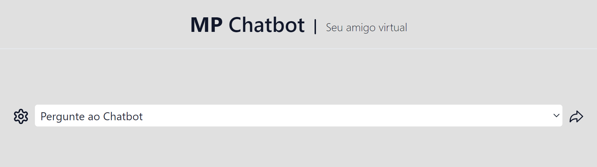
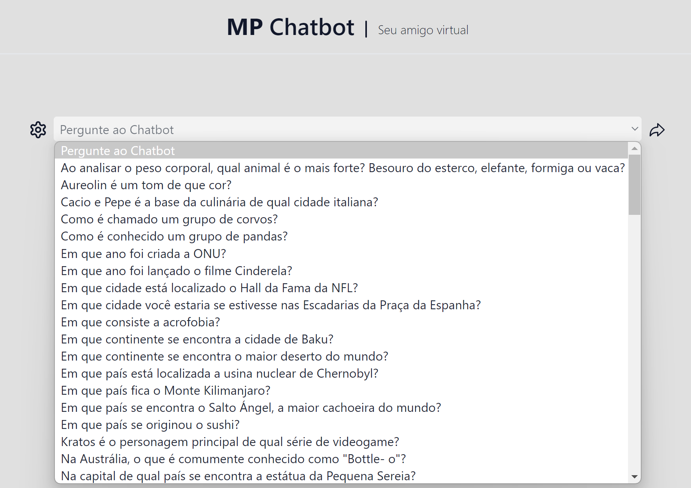
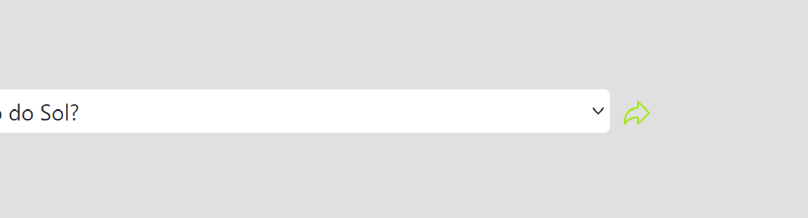
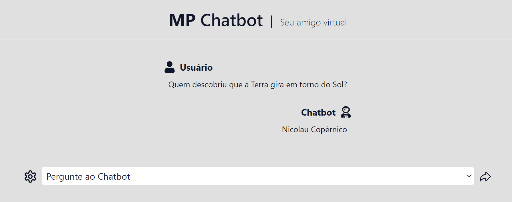
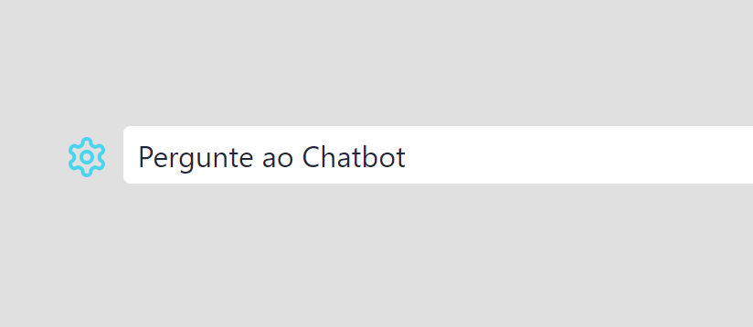
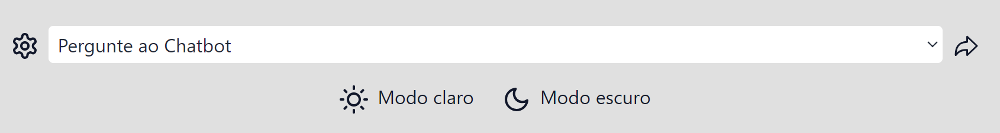
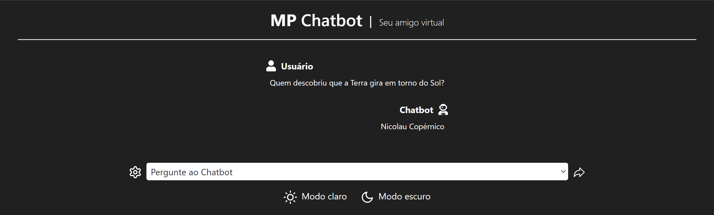

# MP Chatbot 🤖

### Link do projeto rodando na Vercel:

🔗 | [Clique aqui para ver o projeto em execução](https://mp-chatbot-sigma.vercel.app/)

## 🚨 Sobre

- **MP Chatbot** é uma "inteligência artificial" bem simples mesmo, trata-se de um projeto pessoal onde eu criei uma API com algumas perguntas e respostas.

- O usuário seleciona qual pergunta que ele deseja e o chatbot vê a resposta daquela pergunta e te responde.

> **Observações:** todas as perguntas e respostas foram extraídas do site [Mentimeter](https://www.mentimeter.com/pt-BR/blog/audience-energizers/55-free-trivia-and-fun-quiz-question-templates).

<div align="center">



</div>

---

### Como funciona?
- Ao acessar, você não verá nada, apenas uma caixa escrita "**Pergunte ao Chatbot**"... Ao clicar nessa caixa, uma série de perguntas irá aparecer:

<div align="center">

<small>Todas as perguntas estão ordenadas em ordem alfabética.</small>



</div>

- Ao selecionar a pergunta, você precisa apertar no ícone de enviar que ficará com uma tonalidade verde. Ele fica localizado do lado direito da caixa de seleção de perguntas:

<div align="center">



</div>

- Clicando no ícone de enviar, é feito exatamente isto, é enviada a pergunta para o chatbot responder. Sua pergunta irá aparecer e instântaneamente já é respondida pela "IA".

<div align="center">



</div>

- Você pode selecionar as perguntas uma por uma, mas pode perguntar para o chatbot quantas vezes você quiser. 

---

### Alterando o tema
- Existem dois modos de cores, o **modo claro** e o **modo escuro**. Para alterar entre eles, basta ir no ícone de engrenagem que tem do lado esquerdo da caixa de seleção de perguntas. O ícone vai ficar com uma tonalidade azul ao ser clicado:

<div align="center">



</div>

- Fazendo isso, dois botões irão aparecer logo abaixo da caixa de seleção de perguntas:

<div align="center">



</div>

- Para alterar entre os modos, basta clicar em um dos botões, botão "**Modo claro**" caso queira o modo claro e botão "**Modo escuro**" caso queira o modo escuro. Aqui está uma representação de como fica a aplicação com o modo noturno:

<div align="center">



</div>

> **Observações:** o tema de cor definido pelo usuário fica salvo no local storage (armazenamento local) do navegador.

## ⛏️ Ferramentas utilizadas

- [Next JS](https://nextjs.org/)
- [React Icons](https://react-icons.github.io/react-icons/)
- [TypeScript](https://www.typescriptlang.org/)
- [Tailwind CSS](https://tailwindcss.com/)

## 💻 Como executar o projeto na minha máquina?

- Para executar esse projeto, não é necessário nenhuma configuração. Apenas baixe o zip do próprio GitHub ou clone o projeto.
- Baixe as dependências com ```npm install``` (ou ```npm i```) na raíz da aplicação e execute o projeto com ```npm run dev```. Tudo isso dentro do seu terminal, pode ser o do seu sistema operacional ou da sua própria IDE.

### Como alterar, remover ou adicionar novas perguntas para o Chatbot?

- Vá até o caminho **_src/pages/api_** e procure o arquivo **_questionAndAnswer.ts_**, nesse arquivo, estão todas as perguntas e respostas da aplicação.

- Para adicionar, remover ou alterar perguntas, procure uma constante chamada **_questionsAndAnswers_**, ela tem o seguinte formato:

```TypeScript
type ModelQuestionAndAnswer = {
	question: string
	answer: string
}

const questionsAndAnswers: ModelQuestionAndAnswer[] = [
	{
		question: "Pergunta.",
		answer: "Resposta da pergunta."
	}
]
```
#### Alterar perguntas
- Basta procurar a pergunta que deseja alterar e mudar para a pergunta alterada, lembre também de mudar a resposta.

#### Remover perguntas
- Apague as chaves que está ao redor da pergunta e todo o seu conteúdo, respeitando a sintaxe do TypeScript.

#### Adicionar perguntas
- Adicione um novo item nesse array de objetos, ao dar <kbd>Ctrl</kbd> + <kbd>Espaço</kbd> (ou <kbd>⌘</kbd> + <kbd>Espaço</kbd> no MacOS) no [Visual Studio Code](https://code.visualstudio.com/), o autocomplete irá te ajudar a completar com a ```Object.key``` correta. Você pode copiar uma pergunta já pronta e alterá-la ou criar uma nova lembrando de respeitar a sintaxe do TypeScript para a aplicação não compilar com erros.
